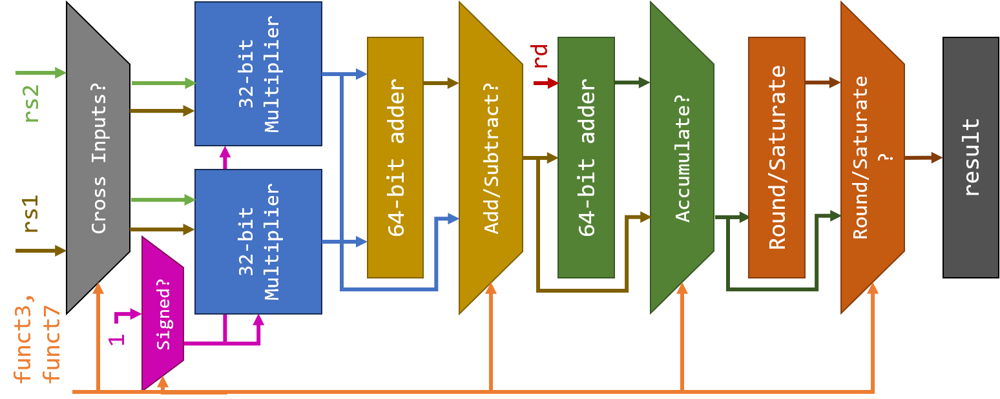

# C-Class Core Generator

For information about the project this repository is dedicated to, jump to [this section](#pext)

## What is C-Class 

C-Class is a member of the [SHAKTI](https://shakti.org.in) family of processors.
It is an extremely configurable and commercial-grade 5-stage in-order core supporting the standard
RV64GCSUN ISA extensions. The core generator in this repository is capable of configuring the core
to generate a wide variety of design instances from the same high-level source code. The design instances
can serve domains ranging from embedded systems, motor-control, IoT, storage, industrial applications
all the way to low-cost high-performance linux based applications such as networking, gateways etc.

There have been multiple successful silicon [prototypes](http://shakti.org.in/tapeout.html)
of the different instances of the C-class thus proving its versatility. The extreme parameterization
of the design in conjunction with using an HLS like Bluespec, it makes it easy to add new features
and design points on a continual basis.

## Why Bluespec
The entire core is implemented in [Bluespec System Verilog (BSV)](https://github.com/BSVLang/Main), 
an open-source high-level hardware description language. Apart from guaranteeing synthesizable
circuits, BSV also gives you a high-level abstraction, like going from assembly [level programming] 
to C. You don’t do the dirty work, the compiler does all the work for you. It enables users to work 
at a much higher level thereby increasing throughput. 

The language is now supported by an open-source Bluespec compiler, which can generate synthesizable
verilog compatible for FPGA and ASIC targets.

## RISC-V "P" Instruction Set Extension

The aim of this project is to implement the proposed [RISC-V "P" instruction set extension](https://github.com/riscv/riscv-p-spec/blob/master/P-ext-proposal.adoc) comprising
of Packed Single Instruction, Multiple Data (PSIMD) instructions on Shakti’s C-Class SoC. This will 
enable the processor to run various DSP applications with lower power and higher performance.

  

To this end, a module was built to implement RISC-V’s PSIMD extension and integrated with the pipeline
of the C-Class processor. A sign-configurable multiplier was designed for performing PSIMD computations
efficiently. A generalized system was devised to generate the boolean logic for decoding the funct3 and
funct7 portions of the instructions.

  

A randomized testing infrastructure for checking functional correctness was developed using Python and 
Bluespec. The Python script generates random test inputs and the expected/golden output and creates a
Bluespec testbench for the SoC. Then, a simple bash script runs a Verilator simulation of the SoC testbench
and compares the golden and actual outputs.

The implementation of this extension provides, on average, a 30x speedup for relevant SIMD computations,
enabling Shakti to perform DSP and AI computations significantly faster.

## License
All of the source code available in this repository is under the BSD license. 
Please refer to LICENSE.iitm for more details.

## Get Started [here](https://c-class.readthedocs.io/)

## Contributors (in alphabetical order of last name):

- Rahul Bodduna
- Neel Gala
- Vinod Ganesan
- Aniketh Ganesh
- Vaibhav Krishna Garimella
- Paul George
- Aditya Govardhan
- Arjun Menon
- Girinath P
- Deepa N Sarma
- Sadhana S
- Snehashri S
- Aditya Terkar

For any queries, please contact shakti.iitm@gmail.com

